# 🕸️ CrimeNet AI — AI-Powered Criminal Network Analysis System

**Smart India Hackathon 2025 · Ministry of Home Affairs — India**

> 🚨 **Interactive demo:** run `bash start.sh --demo` (Node.js 20+) → open
> `http://localhost:3000` → click **Explore demo**. No Docker, database, API key
> or model download needed — everything runs locally in your browser.
> Full-stack mode (real Neo4j + local LLM) is documented below.
>
> ⚠️ All people, relationships and scores are **synthetic**. For software
> evaluation only.

CrimeNet AI ingests police records (FIRs, CDRs, bank/UPI transactions, vehicle
data), extracts entities with NLP, builds a **Neo4j criminal knowledge graph**,
and applies **risk scoring, anomaly detection, crime prediction and a local
LLM assistant** to help investigators see — and disrupt — entire networks
instead of single suspects.

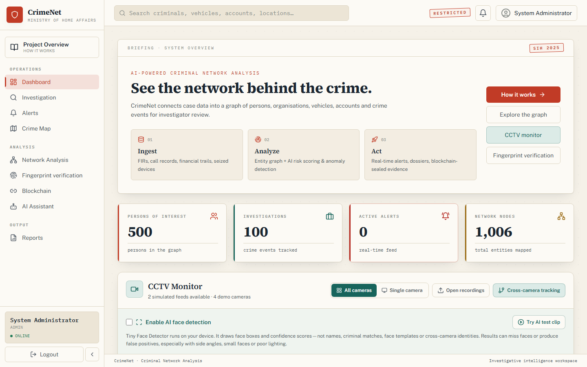

---

## ✨ Feature Matrix

| Module | Highlights |
|---|---|
| 🔐 **Auth & Roles** | Admin · Senior Officer · Officer · Analyst — JWT, per-IP rate limiting, blockchain-backed audit trail |
| 📊 **Dashboard** | Live network stats, case locations, real-time alert feed |
| 🕸️ **Network Analysis** | Interactive Cytoscape graph (500 nodes) · **Path Finder** (shortest path ≤ 6 hops) · **Gang detection** (community detection) · **What-If arrest simulator** |
| 🔎 **Investigation** | **FIR → knowledge graph**: paste raw FIR text, NLP extracts persons / vehicles / accounts / locations and writes them into the graph · intelligent multi-entity search · autonomous investigator |
| 👤 **Criminal Profiles** | Explainable XGBoost risk score, recidivism & crime-type/location prediction, anomaly flags, timeline, analyst actions |
| 🚨 **Alerts** | Real-time WebSocket alerts, rules engine, assign / escalate / resolve with history |
| 🗺️ **Crime Map** | Leaflet hotspot map of 200+ locations with per-crime-type filtering |
| 🤖 **AI Assistant** | Rule-based graph queries (instant) + **local LLM fallback** (Qwen2.5-1.5B, 4-bit GGUF, CPU-only, fully offline) |
| ⛓️ **Integrity Lab** | SHA-256 evidence & report fingerprinting on a blockchain ledger, tamper detection, court-admissibility certificates |
| 🧬 **Fingerprints** | AFIS-style biometric verification flow |
| 🌐 **Cybercrime** | Phishing URL & crypto-wallet scanning, threat intel |
| 📄 **Reports** | Watermarked PDF / CSV / Excel / JSON exports, public share links |
| 🖥️ **CCTV** | Opt-in browser-local person detection (boxes & counts only) |

---

## 🏗️ Architecture

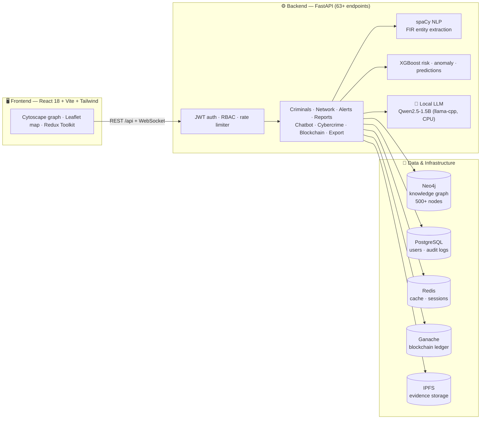

## 🔄 How an FIR becomes intelligence

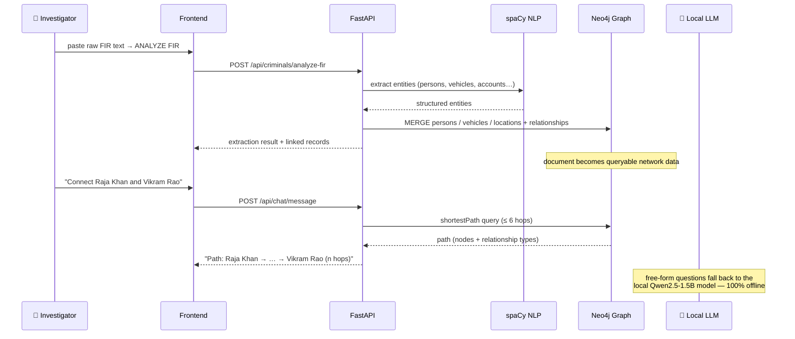

## 🤖 AI Assistant routing

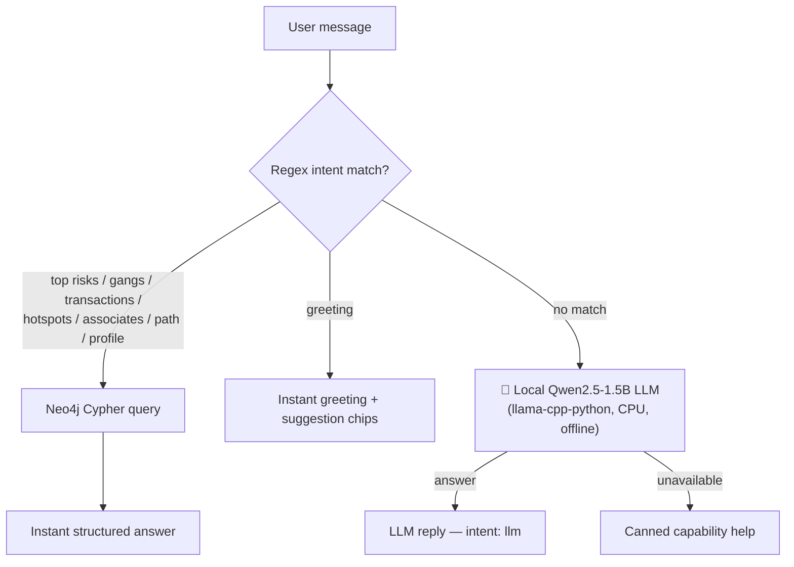

## 🕸️ Knowledge-graph schema

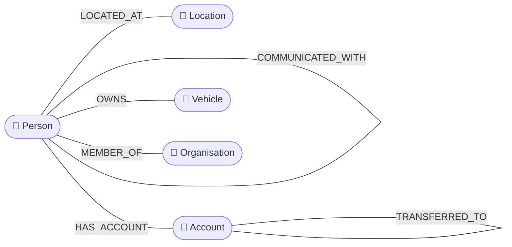

---

## 🚀 Quickstart

### Option A — instant browser demo (no infrastructure)

```bash
bash start.sh --demo          # or: cd frontend && npm run demo
# open http://localhost:3000 → "Explore demo"
```

### Option B — full stack (real Neo4j + local LLM)

```bash
# 1. Data services
docker compose up -d neo4j postgres redis ganache

# 2. Backend  (Python 3.11+)
cd backend
python -m venv venv && venv\Scripts\activate     # Windows
pip install -r requirements.txt
set ML_LOAD_MODELS=false
uvicorn app.main:app --port 8000

# 3. Frontend
cd frontend && npm install && npm run dev
# open http://localhost:3000
```

**Demo accounts**

| Role | Badge / login | Password |
|---|---|---|
| Admin | `admin@crimenet.gov.in` | `Admin@123` |
| Officer | `officer@crimenet.gov.in` | `Officer@123` |
| Analyst | `analyst@crimenet.gov.in` | `Analyst@123` |
| Senior Officer | `senior@crimenet.gov.in` | `Senior@123` |

### Optional — local LLM assistant

```bash
pip install llama-cpp-python --extra-index-url https://abetlen.github.io/llama-cpp-python/whl/cpu
# drop any chat GGUF into backend/data/models/llm/ (e.g. Qwen2.5-1.5B-Instruct Q4_K_M, ~986 MB)
# it loads in the background at startup; ~1 GB RAM, CPU-only, fully offline
```

---

## 🖼️ Screenshots

| | |
|---|---|
| 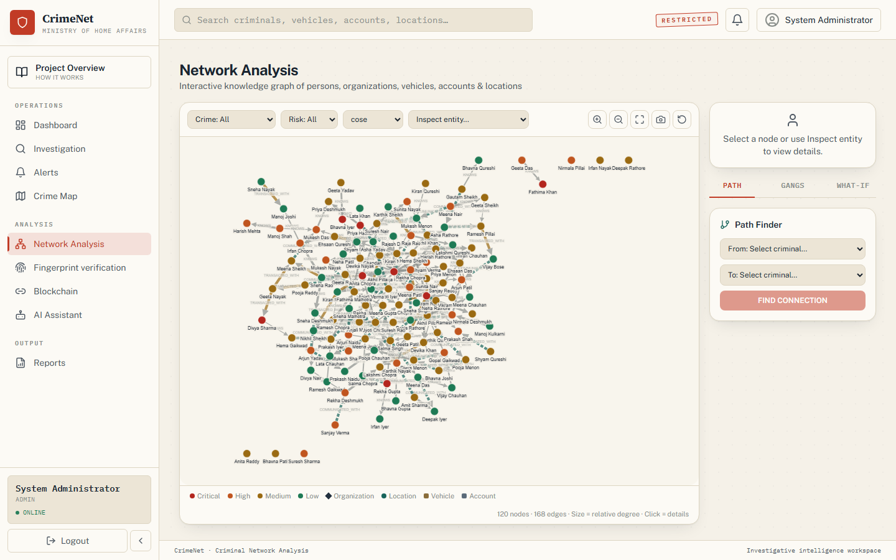 | 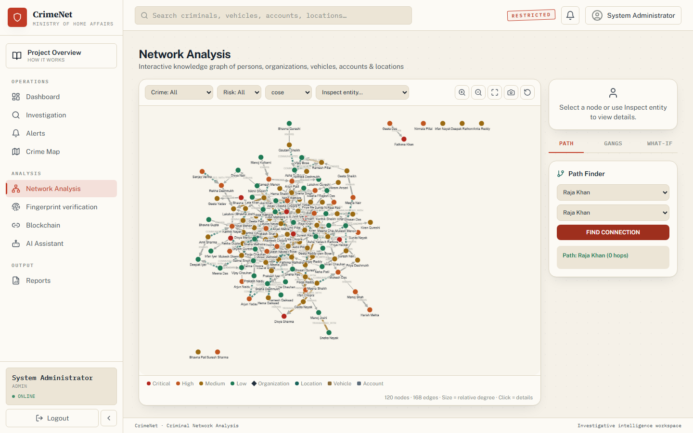 |
| *Interactive network graph* | *Path Finder: Raja Khan ⇄ Vikram Rao* |
| 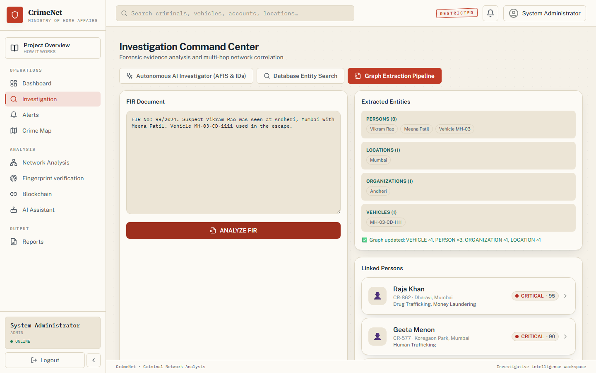 | 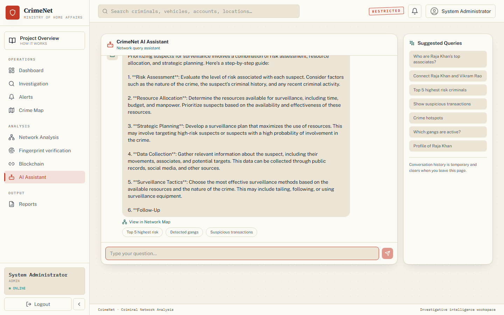 |
| *FIR → knowledge-graph extraction* | *Local-LLM assistant answer* |
| 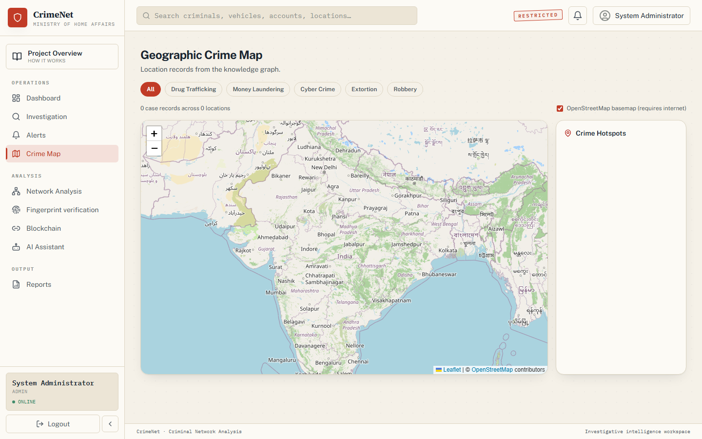 | 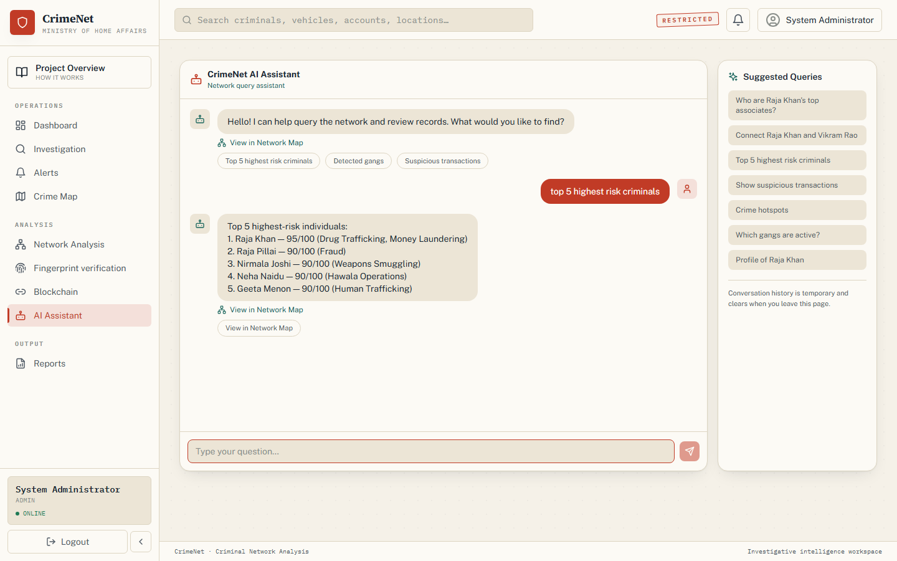 |
| *Geographic crime hotspots* | *Rule-based graph queries* |

---

## 🧪 Testing

- **API sweep** — 63 endpoints across 14 route groups (auth, criminals,
  network, alerts, chat, search, reports, export, cybercrime, blockchain,
  actions, demo): **all green**.
- **Playwright UI sweep** — `backend/ui_sweep.py` drives every page in real
  Chromium, capturing console errors, page errors and failed requests
  (screenshots in `backend/ui_sweep_shots/`). **4 role logins, 13 pages,
  0 errors.**
- Path Finder, FIR extraction, chat intents and LLM answers are exercised
  end-to-end through the real UI on every run.

## 📚 Documentation

- [DEMO_VIDEO_SCRIPT.md](DEMO_VIDEO_SCRIPT.md) — timed 5-minute video walkthrough
- [DEMO_GUIDE.md](DEMO_GUIDE.md) — browser demo guide & limitations
- [PROJECT_EXPLANATION.md](PROJECT_EXPLANATION.md) — architecture deep-dive
- [FEATURE_CHECK.md](FEATURE_CHECK.md) — feature verification matrix

## 🛠️ Tech stack

`React 18` · `Vite` · `Tailwind CSS` · `Redux Toolkit` · `Cytoscape.js` ·
`Leaflet` · `FastAPI` · `llama-cpp-python` · `spaCy` · `XGBoost` · `scikit-learn` ·
`Neo4j` · `PostgreSQL` · `Redis` · `Ganache` · `IPFS` · `Playwright` · `Docker Compose`

---

> ⚠️ **Disclaimer** — CrimeNet AI is a hackathon prototype operating entirely
> on synthetic data. It is not connected to any real police database and makes
> no claims of production readiness or investigative accuracy.
